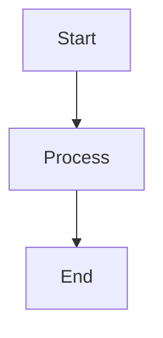

# Title

- **[My GRC Post](test-blog.md)**
  *Security, GRC*

## coding tab
```{.python title="pythoncode.py" linenums="1" hl_lines="2 3"}
name = "User"
age = 25  # <- Line 2 highlighted
double_age = age * 2  # <- Line 3 highlighted
print(f"Hello {name}")
```

## parallel tabs test

=== "tab one"
    Indentation matters - Everything inside a tab must be indented (usually 4 spaces).

=== "Nested / grouped tabs (tabs inside tabs)"

    === "FastAPI"

        FastAPI content here.

    === "Django"

        Django content here.

## Admoniton feature - Calls out contents

!!! tip "title optional
    This feature works. :smile"

!!! info

!!! warning

!!! danger

!!! success

!!! note

??? note "Expanded note"
    Starts collapsed.

???+ note
    Expanded by default

## flowchart diagram

There are more types of diagram like sequential and more. Checkout the blog




<div class="share-buttons">
  <a href="https://x.com/intent/post?text={{ page.title }}&url={{ page.canonical_url }}" class="share-x">
   Share on 𝕏 
  </a>
  <a href="https://www.linkedin.com/sharing/share-offsite/?url={{ page.canonical_url }}" class="share-linkedin">
    Share on Linkedinℹ️ 
  </a>
</div>